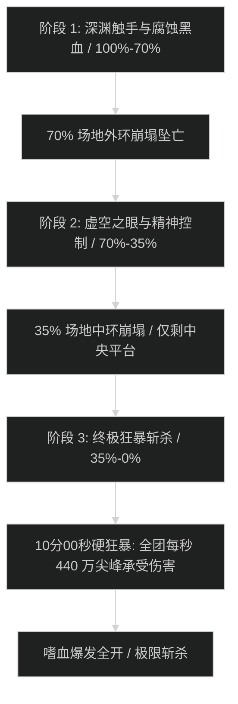

# 亵渎者 乌拉特克 (Ula'tek the Defiler) 史诗攻坚指南

## 1. 战斗流程与三阶段时序图

---

## 2. 核心技能与灭团机制

- **阶段 1：腐蚀黑血 (Corrupted Black Blood)**：
  - 首领召唤 3 根巨型深渊触手拍击场地。触手被击杀时喷涌黑血，必须由具备强力吸收盾的职业（如血DK、防骑、惩戒骑无敌）单吃吸收球，漏球引发全屏自然暴跌。
- **阶段 2：精神腐化之眼 (Gaze of Madness)**：
  - 场地刷新 2 只虚空之眼，点名 4 名队员进行精神控制（心控）。心控前队员必须将控制大招交掉，其余队员使用单体昏迷与减速将心控队员打至 50% 血量解控，严禁直接将其打死。
- **阶段 3：场地崩塌与终极狂暴 (Final Collapse)**：
  - 首领血量降至 35% 时，场地仅剩下中央直径 25 码的圆形平台。全屏每 4 秒施放一次【深渊灭绝】，全团承受伤害瞬时峰值达到 440 万/秒。
  - **坦克死刑【亵渎撕裂】**：造成 240 万物理与暗影混合直伤，换坦必须在 1 层立即嘲讽。

---

## 3. 史诗难度核心减伤链排布 (P3 狂暴阶段)

| 时间轴波次 | 首领施法技能 | 团队减伤技能组合 | 治疗爆发技能组合 |
| :--- | :--- | :--- | :--- |
| **P3 第 1 波** | 深渊灭绝 (1) | 死亡骑士【反魔法领域 (大罩)】 + 战士【集结呐喊】 | 恢复萨满【升腾】 + 先祖图腾 |
| **P3 第 2 波** | 深渊灭绝 (2) | 圣骑士【虔诚光环 (光环掌握)】 + 戒律牧【全光晕】 | 神圣圣骑士【美德道标】 + 晨光射线爆发 |
| **P3 第 3 波** | 深渊灭绝 (3) | 德鲁伊【野性之心】 + 猎人【狂风守护】 | 神圣牧师【神圣赞美诗】 + 救赎灵击 |
| **P3 第 4 波** | 深渊灭绝 (4) | 全员交出本职全部个人 20%-40% 减伤 | 4 治疗全交治疗药水与爆发饰品强刷 |
| **P3 第 5 波** | 10分00秒狂暴 | **无敌 / 保护祝福 / 冰封之韧单吃** | **全员必须在此波前将首领打死** |

---

## 4. 职责分工表

| 职责 | 核心行动要点 | 关键自保与灭团预警 |
| :--- | :--- | :--- |
| **坦克 (Tank)** | 亵渎撕裂必须 1 层秒换坦；死刑读条时必须覆盖核心大减伤；转阶段拉怪面向外围。 | 换坦慢 1 秒直接倒双坦；触手拍击未避开被拍落平台坠亡。 |
| **治疗 (Healer)** | P1-P2 严格控蓝，蓝量在进入 P3 前必须保持在 65% 以上；P3 严格按秒交减伤。 | P3 技能交重叠导致后续波次无减伤灭团。 |
| **输出 (DPS)** | P2 心控迅速救人，严禁开爆发打队友；P3 开启全爆发药水与嗜血，站桩全力斩杀。 | 贪刀被外环崩塌落入深渊直接秒杀。 |

---

## 5. 新人开荒 SOP vs 伐木冲分打法

- **新人开荒策略**：采用 2 坦克 + 4 治疗 + 14 输出标准配置；全员以生存和机制对撞为核心，P3 前全员零减员；嗜血固定在 35% 进入 P3 瞬间开启。
- **伐木冲分打法**：输出人均秒伤必须达到 270k+，利用恶魔术与武器战在 P3 斩杀期的绝对优势，在第四波【深渊灭绝】来临前（约 9分20秒）提前击杀首领。
- **核心战利品**：击杀史诗乌拉特克有概率掉落全版本最强输出/坦克双 BiS 饰品——**乌拉特克的饕餮之心 (Voracious Heart of Ula'tek)**。
